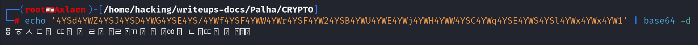
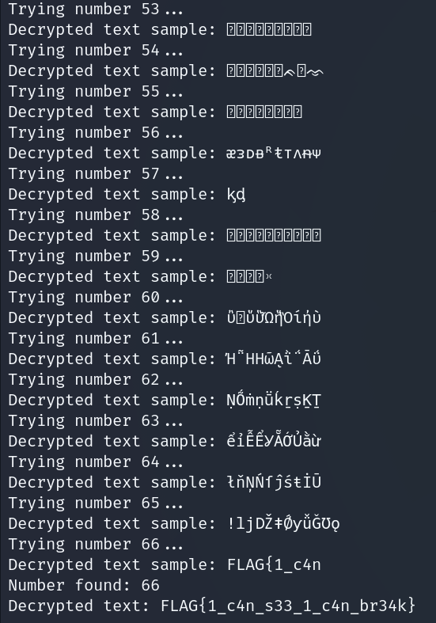

# **CYP**

**Autor**: Hakal  
**Desafio**: One Cipher  
**Nível**: Médio  

---

## **1. Introdução**

Neste write-up, documentaremos o processo completo de decodificação de uma string codificada em Base64 e criptografada usando uma técnica de **XOR** com uma chave fornecida e um número aleatório. A criptografia foi implementada em várias camadas, sendo finalizada com codificação em Base64. O objetivo final é reverter o processo de criptografia para recuperar a **flag** escondida.

Este desafio exige conhecimento sobre criptografia simétrica, manipulação de strings e técnicas de XOR, e na minha opinião se encaixa no nível **médio** de dificuldade.

---

## **2. Análise do Código de Criptografia**

O código de criptografia pode ser dividido em três partes principais:

1. **Inversão da Chave**: A chave fornecida é invertida.
2. **XOR com a chave**: O texto é criptografado utilizando operações XOR, com cada caractere sendo combinado com a chave.
3. **XOR com um número aleatório elevado ao quadrado**: A última etapa adiciona outra camada de XOR, usando um número aleatório entre 1 e 100, elevado ao quadrado.

Abaixo está o código completo utilizado para criptografar o texto:

```python
def reverse_key(key):
    return key[::-1]

def add_random_number():
    random_number = random.randint(1, 100)
    return str(random_number)

def encrypt_text(text, key):
    encrypted_text = ''
    key_length = len(key)
    for i, char in enumerate(text[::-1]):
        key_char = key[i % key_length]
        encrypted_char = chr(ord(char) ^ ord(key_char))
        encrypted_text += encrypted_char
    return encrypted_text

def xor_with_number(encrypted_text, number):
    elevated_number = number ** 2
    encrypted_text_xor = ''
    for char in encrypted_text:
        encrypted_char = chr(ord(char) ^ elevated_number % 1114112)
        encrypted_text_xor += encrypted_char
    return encrypted_text_xor
```

---

## **3. Processo de Decodificação**

A decodificação do texto criptografado foi realizada em várias etapas, e vou tentar explicar cada uma delas de forma detalhada.

---

### **Passo 1: Decodificação Base64**

A primeira etapa foi decodificar a string codificada em Base64. Aqui está a string fornecida:

```bash
4YSd4YWZ4YSJ4YSD4YWG4YSE4YS/4YWf4YSF4YWW4YWr4YSF4YW24YSB4YWU4YWE4YWj4YWH4YWW4YSC4YWq4YSE4YWS4YSl4YWx4YWx4YW1
```

Utilizamos um binário de decodificação de Base64, e o resultado foi a seguinte string criptografada, com caracteres não legíveis:


```bash
echo '4YSd4YWZ4YSJ4YSD4YWG4YSE4YS/4YWf4YSF4YWW4YWr4YSF4YW24YSB4YWU4YWE4YWj4YWH4YWW4YSC4YWq4YSE4YWS4YSl4YWx4YWx4YW1' | base64 -d
```

**Saída:**



---

### **Passo 2: Reversão do XOR com o número aleatório**

Sabemos que o próximo passo na criptografia envolveu aplicar um XOR entre a string e um número aleatório, que foi elevado ao quadrado. O número aleatório foi gerado entre 1 e 100. Para reverter isso, fizemos uma busca exaustiva, testando cada número ao quadrado entre 1² e 100².

A lógica por trás desse passo foi tentar cada número e verificar se o resultado gerava uma string legível. O código para reverter essa operação de XOR foi o seguinte:

```python
def xor_with_number_decrypt(encrypted_text, number):
    decrypted_text = ''
    elevated_number = number ** 2
    for char in encrypted_text:
        decrypted_char = chr(ord(char) ^ elevated_number % 1114112)
        decrypted_text += decrypted_char
    return decrypted_text

# Testamos para valores de 1 até 100
for number in range(1, 101):
    decrypted_xor = xor_with_number_decrypt(decoded_text, number)
    # Se todos os caracteres são legíveis
    if all(32 <= ord(c) <= 126 for c in decrypted_xor):
        break
```

Aqui encontramos o número correto e recuperamos uma string parcialmente decodificada.

---

### **Passo 3: Descriptografando com a chave invertida**

A próxima etapa foi desfazer a criptografia com a chave. Como a chave havia sido invertida no processo de criptografia, precisávamos usar a chave original invertida novamente para reverter esse passo. A chave original fornecida no arquivo `key.txt` era:

```
83b0f13e-794f-11ef-83c6-00155db0496d
```

Ao inverter, obtivemos:

```
d6940bd55100-6c38-fe11-f497-e31f0b38
```

Utilizamos essa chave para descriptografar a string XOR restante:

```python
def decrypt_text(encrypted_text, key):
    decrypted_text = ''
    key_length = len(key)
    for i, char in enumerate(encrypted_text):
        key_char = key[i % key_length]
        decrypted_char = chr(ord(char) ^ ord(key_char))
        decrypted_text += decrypted_char
    return decrypted_text[::-1]  # Reverter o texto, pois ele foi invertido na criptografia
```

Finalmente, agora que entendemos todo o proceso, conseguimos reverter o texto completamente com um código em python customizado e encontrar a **flag**.

```python
import base64

# Função para reverter o XOR com um número elevado ao quadrado
def xor_with_number_decrypt(encrypted_text, number):
    decrypted_text = ''
    elevated_number = number ** 2
    for char in encrypted_text:
        decrypted_char = chr(ord(char) ^ elevated_number % 1114112)
        decrypted_text += decrypted_char
    return decrypted_text

# Função para descriptografar usando a chave invertida
def decrypt_text_with_key(encrypted_text, key):
    decrypted_text = ''
    key_length = len(key)
    for i, char in enumerate(encrypted_text):
        key_char = key[i % key_length]
        decrypted_char = chr(ord(char) ^ ord(key_char))
        decrypted_text += decrypted_char
    return decrypted_text[::-1]  # Reverter o texto, pois ele foi invertido na criptografia

# Chave original pre invertida
key = "83b0f13e-794f-11ef-83c6-00155db0496d"
reversed_key = key[::-1]

# Decodificar a string Base64
encoded_base64_text = "4YSd4YWZ4YSJ4YSD4YWG4YSE4YS/4YWf4YSF4YWW4YWr4YSF4YW24YSB4YWU4YWE4YWj4YWH4YWW4YSC4YWq4YSE4YWS4YSl4YWx4YWx4YW1"
decoded_text = base64.b64decode(encoded_base64_text.encode()).decode(errors='ignore')

# Força bruta para descobrir o número correto
for number in range(1, 101):
    # Primeira etapa: Reverter o XOR com o número
    decrypted_xor = xor_with_number_decrypt(decoded_text, number)
    
    # Segunda etapa: Descriptografar com a chave invertida
    final_decrypted_text = decrypt_text_with_key(decrypted_xor, reversed_key)
    
    # Feedback sobre cada tentativa
    print(f"Trying number {number}...")
    
    # Mostra uma parte do texto descriptografado para ajudar na verificação
    print(f"Decrypted text sample: {final_decrypted_text[:10]}")

    # Verifica se o texto parece legível
    if all(32 <= ord(c) <= 126 for c in final_decrypted_text):
        print(f"Number found: {number}")
        print(f"Decrypted text: {final_decrypted_text}")
        break
```

**Saída:**



---

## **4. Flag Encontrada**

A flag final foi extraída com sucesso após seguirmos todas as etapas sistemáticas de decodificação e descriptografia.

```
FLAG{1_c4n_s33_1_c4n_br34k}
```

---

## **5. Conclusão**

Este desafio envolveu o processo de:

1. Decodificação de uma string Base64.
2. Reversão de operações de XOR realizadas com uma chave invertida.
3. Desfazer uma camada de criptografia que utilizava um número aleatório elevado ao quadrado.

O uso de técnicas de força bruta para encontrar o número correto foi necessário, mas com a compreensão adequada de como a criptografia foi aplicada, a exploração foi conduzida com sucesso, resultando na recuperação da flag.

---
