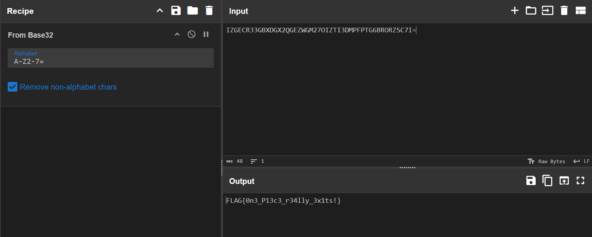
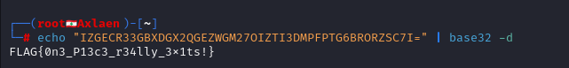

# **EZY**

**Autor**: Hakal  
**Desafio**: BaseXY  
**Nível**: Fácil  

---

## **1. Introdução**

Este desafio consiste em decodificar uma string criptografada em **Base32**, uma forma comum de converter dados binários em texto ASCII. A string foi apresentada no evento **Hacking na Web Day 2024 - SP**, onde os participantes precisavam decodificá-la para obter uma flag e resgatar um adesivo exclusivo.

String fornecida:  
`IZGECR33GBXDGX2QGEZWGM27OIZTI3DMPFPTG6BRORZSC7I=`

---

## **2. Análise da String**

A string `IZGECR33GBXDGX2QGEZWGM27OIZTI3DMPFPTG6BRORZSC7I=` tem características típicas de uma codificação em **Base32**:

1. **Caracteres válidos**: A-Z, 2-7 e o caractere `=` (usado como padding).  
2. **Comprimento**: 56 caracteres (múltiplo de 8, incluindo padding).  
3. **Padding**: O caractere `=` ao final, comum em codificações BaseXX.

---

## **3. Decodificação**

### **Método 1: CyberChef (Operação Magic)**

1. Acesse [CyberChef](https://gchq.github.io/CyberChef/).  
2. Cole a string na área de entrada.  
3. Selecione a opção "From Base32" (ou use o ícone de “mágica”) para decodificar.  
4. A flag será exibida na saída.



### **Método 2: Terminal (Usando binários nativos)**

Em sistemas Unix/Linux, existem binários nativos para decodificar formatos simples como base32 e base64. Para este caso, basta:

```bash
echo "IZGECR33GBXDGX2QGEZWGM27OIZTI3DMPFPTG6BRORZSC7I=" | base32 -d
```

**Parâmetros-Chave**:
- `-d`: executa a decodificação.
- O resultado aparece diretamente em texto/binário, dependendo do conteúdo.

**Saída**:



---

## **4. Conclusão**

**Lições aprendidas**:  
1. Uso de ferramentas online (CyberChef) e do terminal para decodificação e validação.  
2. Observação da presença de padding e caracteres válidos em codificações BaseXX.

**Recomendações de segurança**:  
- Entender que codificação (Base32/64) não é criptografia.  
- Validar entradas antes de decodificar.  
- Usar codificações mais modernas, como Base85, quando necessário.

---