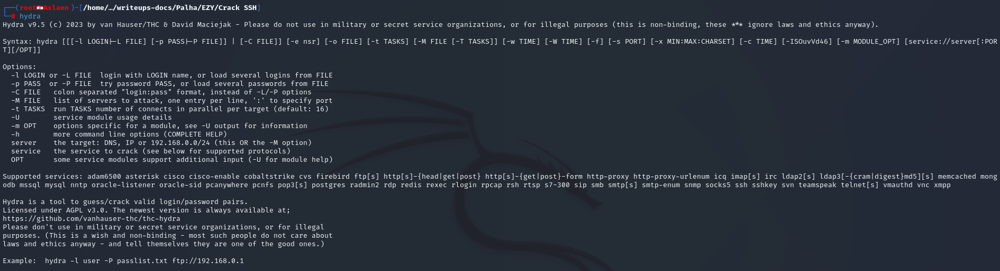

# **EZY**

**Autor**: Hakal  
**Desafio**: Crack SSH  
**Nível**: Fácil  

---

## **1. Introdução**

Neste write-up, documentaremos o processo completo de força bruta contra um servidor SSH localizado no endereço ctf.chapeudepalhahacker.club na porta 3342. O objetivo é descobrir a senha do usuário conhecido como Jhon, conseguindo assim acessar o servidor via SSH e extrair a flag.

Temos informações iniciais de que o usuário do servidor é "Jhon". Utilizaremos técnicas de força bruta para tentar diferentes combinações de senhas até localizar a correta. Após obter a senha, realizaremos o login no servidor SSH para capturar a flag escondida.

Este desafio requer conhecimento sobre autenticação SSH, ferramentas de força bruta e práticas de segurança em redes. Considero que este desafio se encaixa no nível fácil de dificuldade, sendo uma excelente oportunidade para aprimorar habilidades em segurança de redes e testes de penetração.

---

## **2. Ferramenta Utilizada**

A ferramenta que vamos utilizar se chama [Hydra](https://www.kali.org/tools/hydra/). Hydra é uma ferramenta poderosa de força bruta para autenticação em diversos protocolos, incluindo SSH. É uma ferramenta nativa do Kali Linux e, em conjunto com ela, utilizaremos uma wordlist, que é um conjunto de palavras com senhas comumente utilizadas.

A wordlist mais comum é a [rockyou](https://github.com/danielmiessler/SecLists/blob/master/Passwords/Leaked-Databases/rockyou.txt.tar.gz), baseada em vazamentos de senhas datados desde 2017. Você pode baixá-la diretamente deste [repositório](https://github.com/danielmiessler/SecLists/blob/master/Passwords/Leaked-Databases/rockyou.txt.tar.gz). Se você estiver usando Kali Linux, basta instalar o pacote [SecLists](https://www.kali.org/tools/seclists/) para obter a wordlist.

Agora, com a ferramenta em mãos, executando-a, devemos obter essa tela:



---

## **3. Executando o Hydra**

Para iniciar o ataque de força bruta, sabendo que o usuário é `john` e que o serviço SSH está na porta `3342` do servidor `ctf.chapeudepalhahacker.club`, executamos o seguinte comando:

```bash
hydra -l john -P /usr/share/wordlists/seclists/Passwords/Leaked-Databases/rockyou.txt ctf.chapeudepalhahacker.club -s 3342 ssh -t4
```

### **Explicação dos Parâmetros:**

- `-l john`: Especifica o nome de usuário a ser alvo do ataque de força bruta, neste caso, "Jhon".

- `-P /usr/share/wordlists/seclists/Passwords/Leaked-Databases/rockyou.txt`: Define o caminho para a wordlist que contém as possíveis senhas a serem testadas durante o ataque.

- `ctf.chapeudepalhahacker.club`: Endereço do servidor SSH alvo.

- `-s 3342`: Indica a porta do serviço SSH no servidor alvo.

- `ssh`: Especifica que o protocolo a ser atacado é o SSH.

- `-t4`: Define o número de threads simultâneas utilizadas durante o ataque, aumentando a velocidade de testes das senhas.

Cada um desses parâmetros desempenha um papel crucial na configuração do ataque de força bruta. A opção `-l` define o usuário específico a ser atacado, enquanto a `-P` aponta para a lista de possíveis senhas. O endereço e a porta (`ctf.chapeudepalhahacker.club` e `-s 3342`) direcionam o Hydra para o alvo correto. O protocolo (`ssh`) informa ao Hydra qual serviço está sendo atacado, e a opção `-t4` otimiza o processo ao utilizar múltiplas threads, acelerando a tentativa de senhas.

Após a execução bem-sucedida deste comando, se a senha correta for encontrada, o Hydra exibirá as credenciais válidas conforme abaixo:


---

## **4. Obtendo a Flag**

Agora, com a senha `iloveyou` podemos conectar na máquina usando o usuário e senha e obter a flag. Para essa etapa, vamos efetuar um simples login.

```bash
ssh john@ctf.chapeudepalhahacker.club -p 3342
```


Assim que concluir o login, a flag ficará visível no próprio banner do serviço, dispensando qualquer etapa extra de enumeração.

---

## **5. Conclusão**

A técnica empregada consiste em um ataque simples de força bruta, válido somente em contextos autorizados. Revise logs e policie portas para mitigar ataques em produção. Aqui, a descoberta da senha finaliza o desafio, garantindo acesso ao banner com a flag.

---
