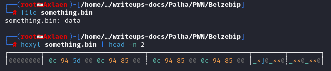
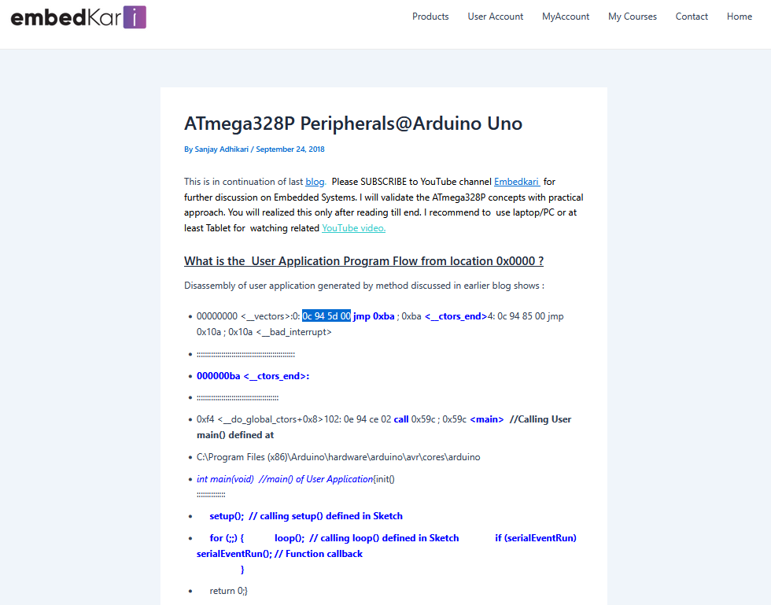
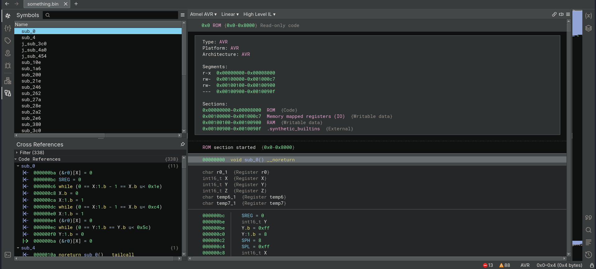
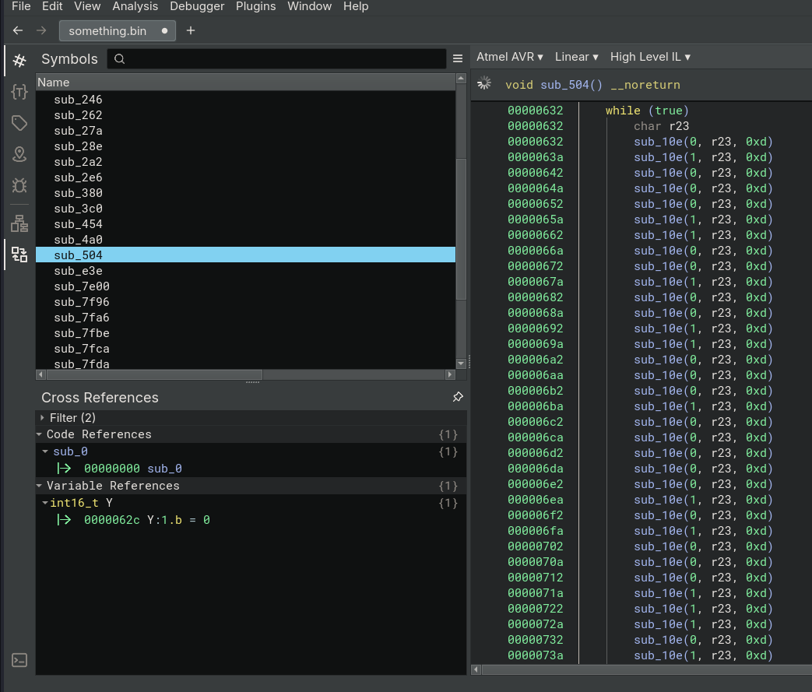
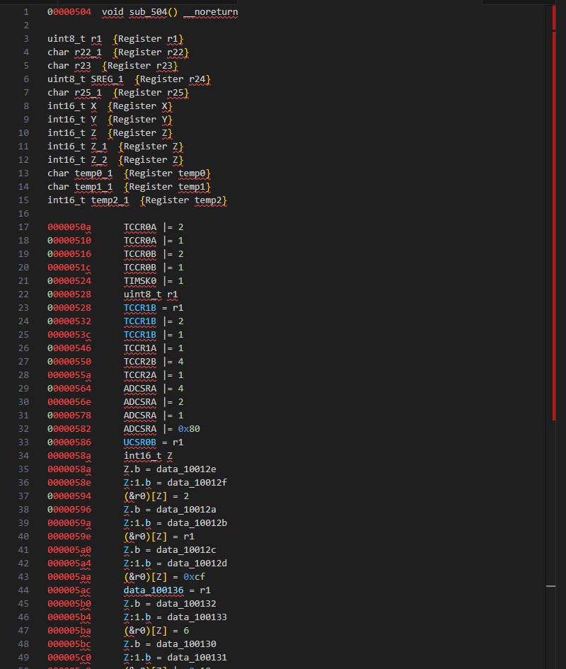
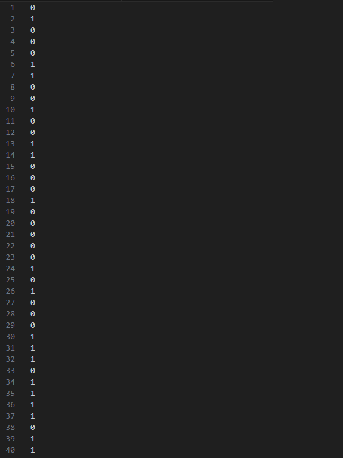
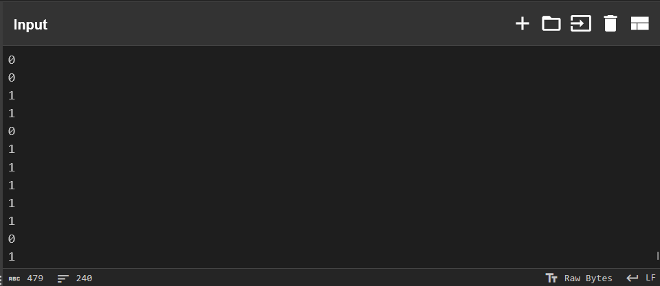
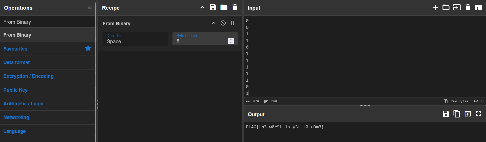

# **PWN**

**Autor**: Hakal  
**Desafio**: Belzebip  
**Nível**: Médio  

---

## **1. Introdução**

Este desafio propõe a análise de um arquivo binário com indícios de conter instruções para um microcontrolador. A ideia central é entender a arquitetura subjacente, suas opcodes e analisar como o binário lida com periféricos de I/O, como timers e possível controle de saídas que emitem “bips”.

---

## **2. Análise do Arquivo**

O arquivo `something.bin` fornecido contem algumas familiaridades.

Se executarmos um file `something.bin` ele retorna o formato como *data*, isso não faz tanto sentido, por isso vamos observar mais no detalhe os primeiros bytes para identificar o formato real e saber como seguir para os próximos passos.

Para essa identificação, vou usar o `hexyl` ferramenta de visualização de hexadecimais de arquivos, porém, como só quero ver as primeiras linhas, vou filtrar para não ser exibido em toda tela.

```bash
hexyl something.bin | head -n 2
```

**Saída:**



**Análise:**

- A sequência `0c 94` remete a opcodes de arquiteturas AVR, indicando possível uso de um microcontrolador.
- Os valores iniciais (`0c 94 5d 00 0c 94 85 00`) sugerem instruções típicas de firmware para microcontroladores.
- A ausência de caracteres ASCII, legíveis após os primeiros bytes, reforça a ideia de se tratar de código de máquina. (`_×]0_××0`)

---

## **3. Interpretação dos Hexadecimais**

Pesquisando sobre os primeiros quatro bytes (`0c 94 5d 00`), encontrei um blog de discussão para sistemas embarcados que valida conceitos com testes práticos. 

Nesse blog em específico, ele lidava com `ATmega328P` que coincidentemente correspondia ao nosso programa.



Com a confirmação de que o binário se relaciona a uma arquitetura *avr*, a próxima etapa é realizar a descompilação, configurando as ferramentas adequadas.

---

## **4. Descompilando o Arquivo**

Para descompilar de forma apropriada, é necessário que o descompilador reconheça a arquitetura AVR. Ferramentas como Ghidra ou Binary Ninja, com plugins específicos, podem ser utilizadas:

- [Reverse Engineering Arduino Binaries with Ghidra](https://www.jonaslieb.de/blog/arduino-ghidra-intro/)

- [Reverse Engineering Arduino Binaries with Binary Ninja](https://github.com/fluxchief/binaryninja_avr)

Para este estudo, foi selecionado o Binary Ninja, embora o Ghidra também se mostre eficaz para a mesma tarefa.

---

## **5. Analisando o Binário**

Agora, com o binário em mãos, descompilado e usando a arquitetura correta, nós podemos analisar o que acontece aqui. 



Pelo que foi dito no parágrafo, o binário faz alguns bips, isso é uma dica forte de que ele controla provavelmente a entrada e saída I/O. Então, vamos procurar algo que se assemelhe a esse comportamento descrito.

Após uma análise aprofundada de cada função, encontrei a função `sub_504` que continha um `wilhe (true)` explícito e apresentava um comportamento de I/O, ou seja, uma rotina que iniciava o hardware do microcontrolador configurando periféricos, como timers, ADC e comunicação serial. No resumo, vários registradores para controlarem o tempo e fazer a inicialização.



No loop principal (`0x632-0xdd6`) tem uma sequência extremamente longa (por volta de 200 chamadas) para a função `sub_10e` com padrões de binário (`0,1,0,0...`) sendo um possível padrão de LEDs piscando em uma ordem específica, comunicação serial bit-bang ou até mesmo controle de motores/atuadores.

---

## **6. Extraindo as Chamadas**

Por se tratar de um desafio que menciona bips, a hipótese é que o loop principal gere uma sequência de 0s e 1s para controlar hardware externo. Para análise avançada e possível descoberta de uma flag, essa série de bits pode estar embutida no próprio código.
Foi então copiada a função principal para o VSCode, filtrando-se apenas a sequência binária (0/1), resultando em 240 caracteres.



Removendo tudo e deixando apenas a sequência binária (`0/1`), vamos ter no total *240* caracteres. 



Agora, copiando todo esse conteúdo, podemos tentar colocar em um Binary String Decoder e tornar o conteúdo dessa sequência legível. Para esse caso, vou utilizar o [CyberChef](https://gchq.github.io/CyberChef/), ferramenta já utilizada em outros Write-Ups.

Colando todo conteúdo no input, certifico que contém 240 linhas, exatamente a quantidade que obtive nas filtragens com `VScode`.



Agora vamos selecionar a receita no canto superior esquerdo `From Binary` e automaticamente a flag é decodificada da sequência de binários.



---

## **7. Conclusão**

O arquivo `something.bin` apresenta instruções típicas de microcontroladores AVR, no caso o ATmega328P, utilizado em diversos projetos de sistemas embarcados. A descompilação permitiu identificar rotinas de inicialização de hardware (timers e I/O) e um loop principal que controla uma sensação de “bips” ou alternância de sinais binários.

**Principais Aprendizados:**

- Identificação de firmware AVR por meio dos bytes iniciais (`0c 94`, etc.).
- Processo de descompilação ajustado à arquitetura, utilizando ferramentas especializadas (Binary Ninja, Ghidra).
- Geração de sequências de 0s e 1s como método de controle de periféricos ou como “esconder” informações que, quando extraídas e decodificadas, podem revelar dados relevantes (como uma flag ou mensagem).

**Sugestões de Aprendizado:**

- Investigar as bibliotecas usadas na construção do firmware (por exemplo, `<avr/io.h>`).
- Explorar métodos de configuração de timers e interrupções em microcontroladores AVR.
- Analisar se as rotinas identificadas podem ser aplicadas a outros ambientes (como simulação no Proteus ou emuladores de AVR).
- Pesquisar metodologias de Engenharia Reversa em ambientes embarcados, incluindo decodificação de padrões binários que podem conter flags ou mensagens ocultas.

---
