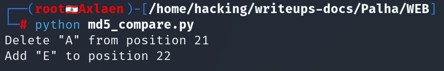
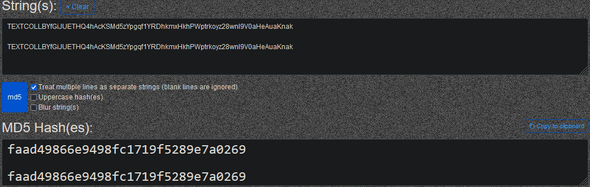
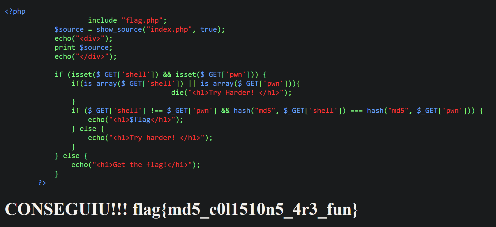

# **WEB**

**Autor**: Hakal  
**Desafio**: Quebre a Hash!  
**Nível**: Fácil  

---

## **1. Introdução**

Neste write-up, abordaremos uma exploração que se aproveita da vulnerabilidade do uso de MD5 para comparar duas strings diferentes que produzem o mesmo valor de hash, conhecido como **colisão de hash**. Embora o MD5 já seja amplamente considerado inseguro, ele ainda é utilizado em algumas aplicações, o que pode ser explorado por um atacante. O objetivo desta exploração foi usar strings geradas para colidir em MD5 e obter a flag do sistema alvo.

---

## **2. Análise do Código Vulnerável**

O código vulnerável está presente em um arquivo PHP simples que utiliza a função `hash("md5", ...)` para comparar duas strings fornecidas pelo usuário. O código é o seguinte:

```php
if ($_GET['shell'] !== $_GET['pwn'] && hash("md5", $_GET['shell']) === hash("md5", $_GET['pwn'])) {
    echo("<h1>$flag</h1>");
} else {
    echo("<h1>Try harder! </h1>");
}
```

Aqui, a comparação entre os valores de `$_GET['shell']` e `$_GET['pwn']` ocorre após o cálculo do hash MD5 de ambas as strings. Isso permite que dois valores diferentes de `$_GET['shell']` e `$_GET['pwn']` tenham o mesmo hash, resultando em uma **colisão MD5** que pode ser explorada para obter a flag.

---

## **3. Exploração da Colisão de Hash**

O objetivo da exploração foi fornecer duas strings diferentes que resultassem no mesmo valor de hash MD5, cumprindo a condição necessária para exibir a flag.

### **Passo 1: Entendendo a colisão MD5**

[Marc Stevens](https://web.archive.org/web/20240319212805/https://twitter.com/realhashbreaker/status/1770161965006008570) demonstrou um exemplo de colisão onde duas strings alfanuméricas que diferem em apenas um byte produzem o mesmo hash MD5. As strings usadas para essa exploração foram:

- String 1: `TEXTCOLLBYfGiJUETHQ4hAcKSMd5zYpgqf1YRDhkmxHkhPWptrkoyz28wnI9V0aHeAuaKnak`
- String 2: `TEXTCOLLBYfGiJUETHQ4hEcKSMd5zYpgqf1YRDhkmxHkhPWptrkoyz28wnI9V0aHeAuaKnak`

Essas duas strings são diferentes, mas produzem o mesmo valor de hash MD5.

### **Passo 2: Comparação das strings**

Para identificar a diferença entre as strings, usamos um código Python que destaca as mudanças:

```python
from difflib import ndiff

def showdiff(a, b):
    for i,s in enumerate(ndiff(a, b)):
        if s[0]==' ': continue
        elif s[0]=='-':
            print(f'Delete "{s[-1]}" from position {i}')
        elif s[0]=='+':
            print(f'Add "{s[-1]}" to position {i}')

a = "TEXTCOLLBYfGiJUETHQ4hAcKSMd5zYpgqf1YRDhkmxHkhPWptrkoyz28wnI9V0aHeAuaKnak"
b = "TEXTCOLLBYfGiJUETHQ4hAcKSMd5zYpgqf1YRDhkmxHkhPWptrkoyz28wnI9V0aHeAuaKnak"

showdiff(a, b)
```

**Saída:**



Essa diferença de um único caractere entre as duas strings não afeta o valor de hash gerado, pois ambas produzem o mesmo hash MD5:



### **Passo 3: Exploração da aplicação web**

Com as strings prontas, abrimos o navegador e executamos a seguinte requisição para a aplicação vulnerável:

```
/index.php?shell=TEXTCOLLBYfGiJUETHQ4hAcKSMd5zYpgqf1YRDhkmxHkhPWptrkoyz28wnI9V0aHeAuaKnak&pwn=TEXTCOLLBYfGiJUETHQ4hEcKSMd5zYpgqf1YRDhkmxHkhPWptrkoyz28wnI9V0aHeAuaKnak
```

**Saída:**

Como esperado, ambas as strings geraram o mesmo hash MD5, cumprindo as condições impostas pelo código e resultando na exibição da flag.



---

## **4. Conclusão**

Aqui está o processo passo a passo que foi seguido para explorar a vulnerabilidade de colisão MD5 e extrair a flag:

### **Passo 1: Identificação da vulnerabilidade**

Identificamos que a aplicação utilizava o algoritmo MD5 para comparar duas strings. Sabendo que o MD5 é suscetível a colisões, preparamos duas strings que geravam o mesmo valor de hash, mas eram diferentes entre si.

### **Passo 2: Geração de strings com colisão**

Com base em estudos de colisão MD5, utilizamos duas strings que diferiam por apenas um byte, mas que, devido à vulnerabilidade do MD5, geravam o mesmo valor de hash.

### **Passo 3: Envio das strings para a aplicação**

Enviamos ambas as strings para a aplicação vulnerável através da URL, o que nos permitiu satisfazer as condições impostas pelo código e obter a flag do desafio.

---
