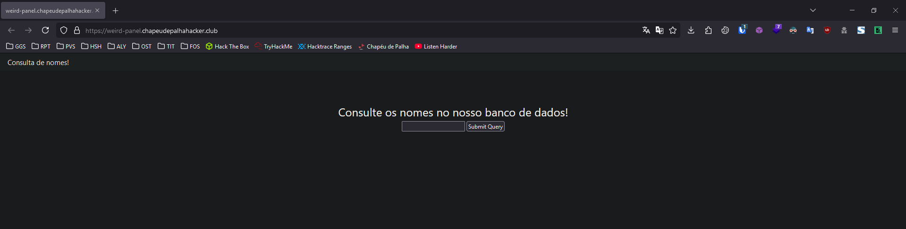
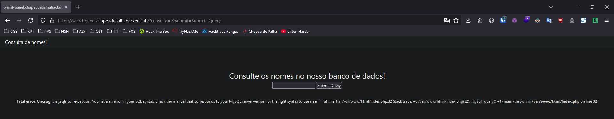
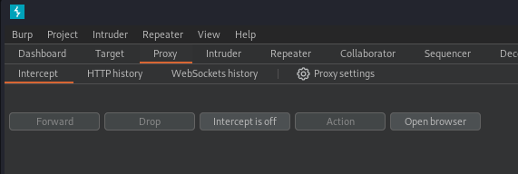
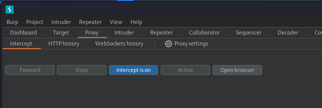
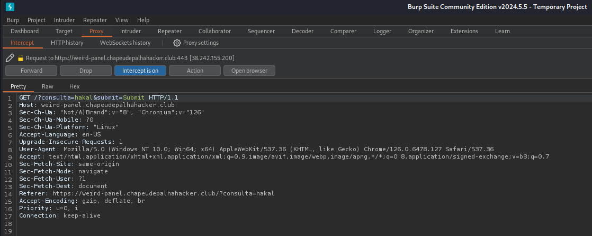
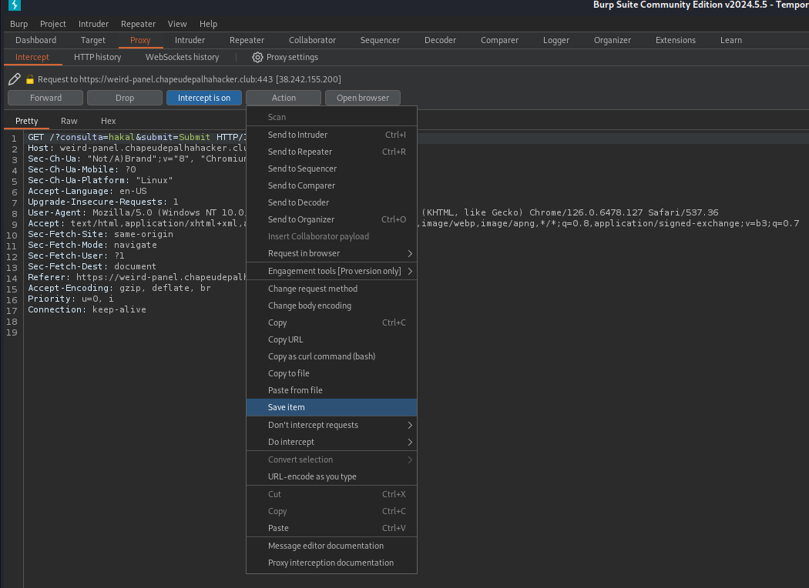
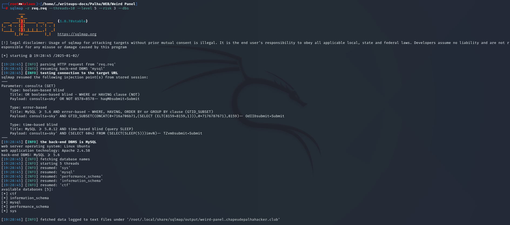
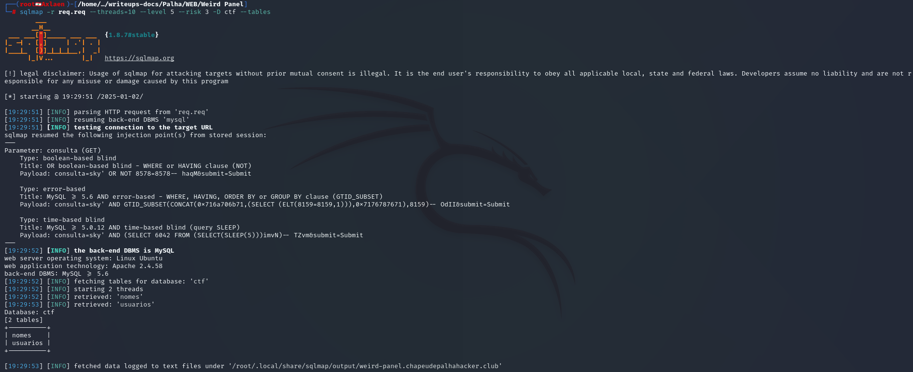
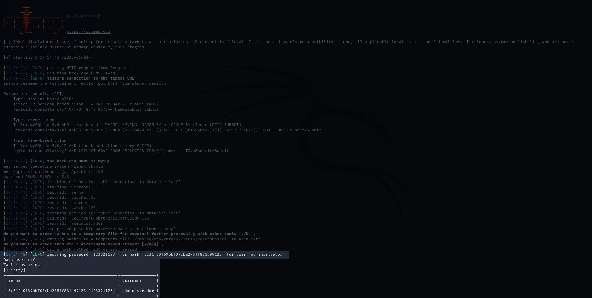
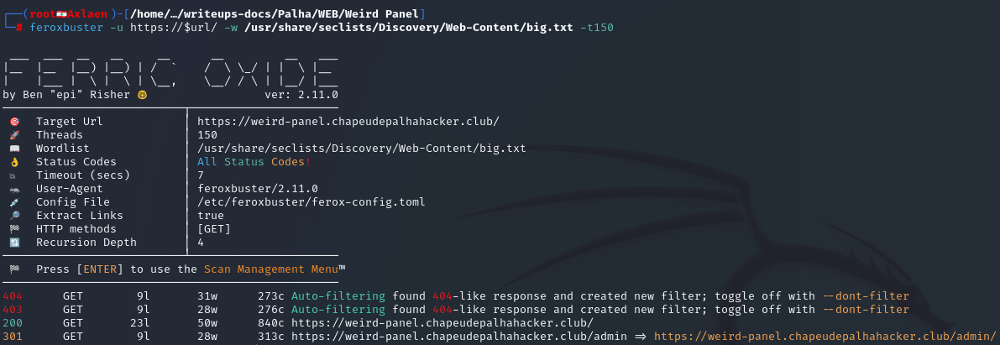

# **WEB**

**Autor**: Hakal  
**Desafio**: Weird Panel  
**Nível**: Fácil  

---

## **1. Introdução**

Este write-up aborda a exploração de uma vulnerabilidade de injeção SQL (SQL Injection) em um sistema de banco de dados. Embora essa vulnerabilidade seja amplamente conhecida, ela ainda pode ser explorada de diferentes formas, como error-based, time-based e blind-based. O objetivo deste estudo é demonstrar como a falha pode ser aproveitada para obter a flag do sistema-alvo.

---

## **2. Identificando a Vulnerabilidade**

Ao acessar o site, encontramos um painel de consulta de nomes e um campo para submissão de queries. 



A injeção de SQL ocorre quando dados de entrada não são devidamente validados, permitindo a manipulação direta das consultas no banco de dados. Um simples teste seria a utilização de `'` para entender como a aplicação reage.



Conforme a imagem acima, ocorre o erro `Fatal error: Uncaught mysqli_sql_exception:` ao enviar `'`, indicando que a entrada não é tratada de forma adequada.  
Essa reação expõe detalhes sobre a estrutura do banco e confirma a fragilidade na validação de parâmetros. Isso ocorre porque o uso do apóstrofo `'` no SQL está principalmente relacionado à delimitação de strings, ou seja, ele é utilizado para envolver valores de texto em consultas SQL. Portanto, podemos utilizá-lo pois é possível interromper a consulta SQL.

---

## **3. Explorando SQLi Error-Based**

A exploração foi realizada em algumas etapas principais.

### **Passo 1: Interceptando a Request**

Inicialmente, vamos interceptar a requisição. Para isso, abra o Burp Suite, vá até a aba de Proxy e abra o navegador.



Com o navegador aberto, acesse a [URL](https://pt.wikipedia.org/wiki/URL) do serviço vulnerável. Antes de efetuar as queries, volte ao Burp Suite e habilite a interceptação de pacotes.



Agora, volte ao navegador e efetue uma query qualquer. No caso, utilizamos um nome.

Se você seguiu os passos anteriores, ao efetuar a query, terá um retorno no Burp como este



Com essa requisição interceptada, podemos salvá-la como um objeto para utilizar nos próximos passos. Nossa intenção é usar essa requisição para ferramentas automatizadas de SQLi, em vez de enumerar tudo manualmente.

Clique em `Action` e selecione a opção `Save item`. Então ela abrirá uma tela de confirmação e pedirá para você escolher o diretório.



### **Passo 2: Explorando com SQLMap**

Com a requisição salva, podemos utilizar o SQLMap para automatizar a exploração da vulnerabilidade de injeção SQL. O SQLMap é uma ferramenta excelente para detecção e exploração de falhas de injeção SQL.

Para utilizar a requisição com SQLMap, execute o seguinte comando:

```bash
sqlmap -r req.req --threads=10 --level 5 --risk 3 --dbs
```

#### **Explicação dos Parâmetros:**

- `-r req.req`: Especifica o arquivo de requisição HTTP salvo que será utilizado pelo SQLMap.
- `--threads=10`: Define o número de threads a serem usadas, aumentando a velocidade da exploração.
- `--level=5`: Define o nível de testes a serem realizados (1 a 5), onde 5 é o mais abrangente.
- `--risk=3`: Define o nível de risco dos testes (1 a 3), onde 3 é o mais agressivo.
- `--dbs`: Informa ao SQLMap para enumerar os bancos de dados disponíveis.

**Saída:**



Conforme acima poodemos visualizar um databse chamado `ctf`, sendo assim vamos começar a exploração por ele. O próximos passos é enumerar as tabelas e colunas.

```bash
sqlmap -r req.req --threads=10 --level 5 --risk 3 -D ctf --tables
```

Aqui seguimos a mesma lógica mas trocamos o `--dbs` por `-D ctf --tables` para especificar o banco de dados `ctf` para exploração e informar ao SQLMap para enumerar as tabelas do banco de dados especificado.

**Saída:**



Agora sabendo que temos duas tabelas sendo: `nomes` e `usuarios`, vamos começar pela tabela de `usuarios` para tentar descobrir alguma forma de obter login na máquina ou site.

Sendo assim trocamos no nosso comando o `--tables` por `-T usuarios --dump-all` para que o SQLMap faça o dump de todas colunas dentro da tabela `usuarios`.

```bash
sqlmap -r req.req --threads=10 --level 5 --risk 3 -D ctf -T usuarios --dump
```

**Saída:**



Agora nós temos o usuário `administrator` e a senha que foi quebrada apenas aceitando às sugestões do SQLMap. Com essa informação significa que podemos logar no sistema. Sabendo que se trata de um serviço `WEB`, podemos executar ataques de força bruta para saber quais os nomes podem ser os do diretório para login.

---

## **4. Descobrindo Diretórios**

Para descobrir o diretório que hospedava o login vamos usar uma ferramenta chamda [feroxbuster](https://github.com/epi052/feroxbuster). Basicamente é uma ferramenta de código aberto, escrita em Rust, usada para força bruta de diretórios e arquivos em servidores web. Ele é projetado para ser rápido, eficiente e fácil de usar, ajudando em atividades de reconhecimento durante testes de segurança, como no contexto de pentests ou red teaming.

Para utilizala é bem fácil, basta especificar o `host` e a `wordlist` que ela vai começar a tentar acessar toda lista de palavra e retornar apenas códigos HTTP's coerentes e válidos para acesso.

```bash
feroxbuster -u https://weird-panel.chapeudepalhahacker.club/ -w /usr/share/seclists/Discovery/Web-Content/big.txt -t150
```

Para nosso contexto o comando acima vai resolver.

#### **Explicação dos Parâmetros:**

- `-u` Especifica a URL alvo.
- `-w` Indica a wordlista que será utilizada no processo
- `-t150` Configura a quantidade de threads a ser utilizada.

**Saída:**



Como evidenciado acima, sabemos que o caminho para login é `/admin` sendo assim, vamos utilizar as credencias anteriormente obtidas e efetuar login no painel.

---

## **5. Obtendo a Flag**

Nessa último etapa foi bem fácil, visto que o usuário é `administrador` a senha `123321123` e o formulário de login está localizado no endereço `https://weird-panel.chapeudepalhahacker.club/admin`.

Acessando o site o formulário é requisitado conforme abaixo:


Ao inserir o usuário e senha obtemos a flag.


---

## **6. Conclusão**